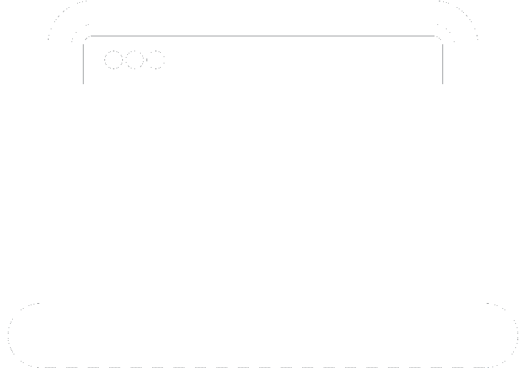

## The beginning

When developing for Arduino, focusing on a cart that was able to follow a predetermined line on the floor, I realized that when making structured code in C++ it was a bad thing, it was simpler to develop the logic, but in the long run I saw myself creating several ``ifs``.

<div class="text-center mt-1 mb-2">
    
</div>

Yes, this meme represents well what I mean. I had to create checks for the sensors, **all the time**, and there were **several** so I can be sure that everything will go well.
I missed the OOP classes, where we create objects and separate things in an organized way, here the code was linear and its ability to be messy was huge.

<div class="text-center mb-2">
    
</div>

Such a code is difficult to maintain and confusing even for those who are programming, imagine for someone else outside the project.
It is simpler to do, much simpler, but it is that programmer's choice:
- <span style="color: #d43c2f">**Make simple code to never mess with it later**</span>
- <span style="color: #38ba47">**Or make a code well done to be used later**</span>

Even if you try to modulate this by creating **several methods**, it will only increase the size of the code (which is included in just one .ino file), making the programmer have to hunt down the part of the code in which he has to perform maintenance.

One solution for this is to use **object orientation for Arduino** in C++, it is a good option, although it increases the complexity for the application, the code is **more readable** and there will be **greater maintenance**.

## State Partner

Thinking of developing an efficient object-oriented code for a line-following cart, I had the following analogy:

> Thinking about a cart working, it will have several **states** in which it should behave **differently**.

Which is true, giving an example, while the cart is moving forward, I wish it to perform certain **checks** and certain **actions**. I want each state of the cart to make it behave differently depending on what is needed.

And thinking about it, I studied the State Design Partner, or **State Machine** for some, and in it we have the concept that something will have a number of states and in those states it must perform determined or even unique behaviors, making transitions between states.

<div class="text-center">
    
</div>

In this simple example we have a button, and in this we can only have 2 possible states: 
<span style="color: #38ba47">**On**</span> and 
<span style="color: #d43c2f">**Off**</span>.

In each state the button will perform a different action, in <span style="color: #38ba47">**On**</span> it will turn on something, in <span style="color: #d43c2f">**Off**</span> it will turn off. What makes him transition from one state to another is the action of **pressing the button**.

Note that it is a very simple concept and we can apply it to Arduino projects. The State Machine is ideal when something is likely to have situations where it will have to behave differently, could this be solved with a simple ``if``? **Yes**, but if the complexity of your application starts to rise, and you see that more and more create ``if`` after ``if``, it is better to rethink what you are doing...

```cpp
if(isSensor) {
    // do something
    if(anotherSensor) {
        // Do something else
    } else {
        // Do something else
    }
} else {
    // do something
}
```

To get around this I created this State Machine model that is able to solve this problem and bring **modularity** to your code, being able to **reuse** and **easy to maintain**.

This is my project, for more information about, follow the link below for the article about the installation.

<!-- Next Post -->
<div class="row">
    <div class="col-md-12">
        <div class="row no-gutters rounded overflow-hidden flex-md-row mb-4 shadow-sm h-md-250 position-relative">
            <div class="col border p-4 d-flex flex-column position-static">
                <strong class="d-inline-block mb-2 title">Install...</strong>
                <p class="card-text mb-auto">In this article we will see how to install the package and know some concepts for using it.</p>
                <a href="another-page.html" class="stretched-link">Continue reading</a>
            </div>
            <a href="#" class="col-3 img-link d-none d-md-flex align-items-center justify-content-center">
                
            </a>
        </div>
    </div>
</div>
